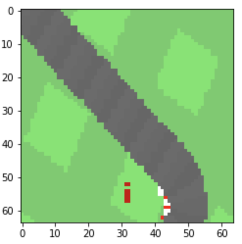
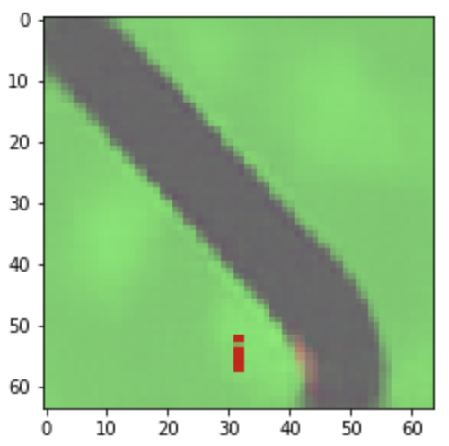
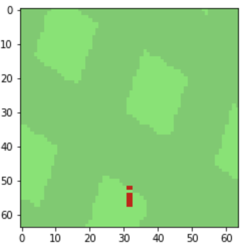
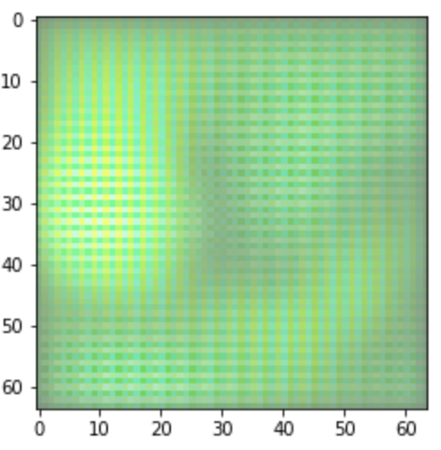
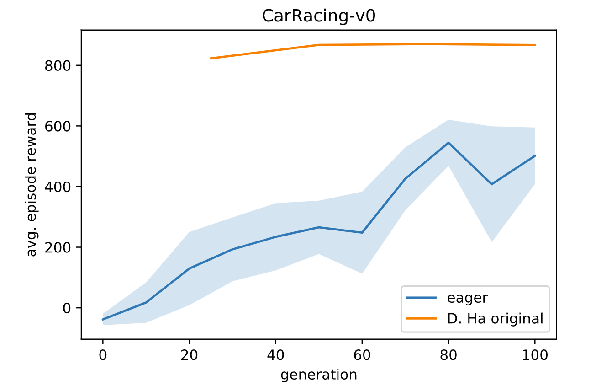

# World Models

This repo reproduces the [original implementation](https://github.com/hardmaru/WorldModelsExperiments) of [World Models](https://arxiv.org/abs/1803.10122). This implementation uses TensorFlow 2.2.

## Docker

The easiest way to handle dependencies is with [Nvidia-Docker](https://github.com/NVIDIA/nvidia-docker). Follow the instructions below to generate and attach to the container.

```
docker image build -t wm:1.0 -f docker/Dockerfile.wm .
docker container run -p 8888:8888 -v /home/ubuntu/world-models:/app --rm -it wm:1.0
```

## Visualizations

To visualize the environment from the agents perspective or generate synthetic observations use the [visualizations jupyter notebook](WorldModels/visualizations.ipynb). It can be launched from your container with the following:

```
jupyter notebook --no-browser --port=8888 --ip=0.0.0.0 --allow-root
```

### VAE

|               Real Frame Sample               |                Reconstructed Real Frame                 |
| :-------------------------------------------: | :-----------------------------------------------------: |
|  |  |

### VAE/GAN

|                 Real Frame Sample                 |                  Reconstructed Real Frame                   |
| :-----------------------------------------------: | :---------------------------------------------------------: |
|  |  |

### VAE/GAN data visualizations

To visualize the VAE/GAN loss and distribution plots as well as the random/reconstucted images, while in the docker container run:

```
tensorboard --logdir='./WorldModels/vae_gan/logs' --port=6006
```

## Reproducing Results From Scratch

These instructions assume a machine with a 4 core cpu.

### CarRacing-v0

To reproduce results for CarRacing-v0 run the following bash script

```
bash launch_scripts/carracing.bash
```

## Disclaimer

We have not run this for long enough(~45 days wall clock time) to verify that we produce the same results on CarRacing-v0 as the original implementation. Our average run time for the VAE and VAE/GAN training was approximately 2/3 days.

Average return curves comparing the original implementation and ours. The shaded area represents a standard deviation above and below the mean.



|                | Generation &nbsp;&nbsp;&nbsp;&nbsp;&nbsp;&nbsp; |     | Returns Actual Environment &nbsp;&nbsp;&nbsp;&nbsp;&nbsp;&nbsp; |
| -------------- | ----------------------------------------------- | --- | --------------------------------------------------------------- |
| D. Ha Original | 2000                                            |     | 868 +/- 511                                                     |
| Eager          | 100                                             |     | 501 +/- 94                                                      |
